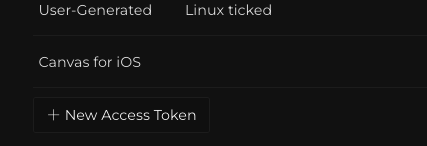
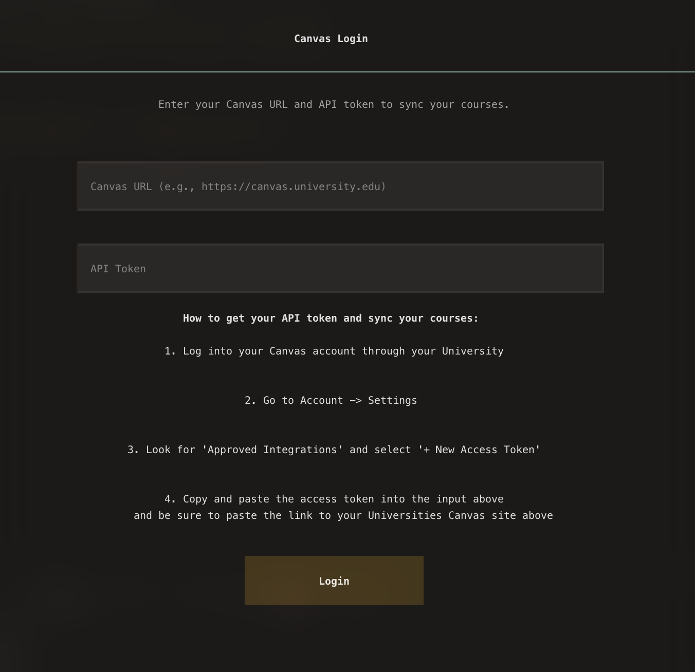

# Canvas LMS Setup and Usage
 

##  Creating an API token to access your University's Canvas System

To access your college's Canvas system, log in to your Canvas account and head to your account settings.

- Scroll down to "Approved Integrations" and click "+ New Access Token"

 

- Copy the access token and paste it into the input container in the Canvas section on Ticked

- For the Canvas URL, it is simply the URL from your Canvas home page. For example: https://canvas.college-name.edu/ - This is typically the format for all Universities that use Canvas.

- Once you are in, you will be met with your courses and your grades for the current semester on the top left, a list of your upcoming assignments and the due date on the bottom right, and a list of all recent announcements on the right, formatted in Markdown.

<a href="#spotify" onclick="event.preventDefault(); loadPage('spotify');">
    <kbd>Next: Spotify →</kbd>
</a>

  

-----

