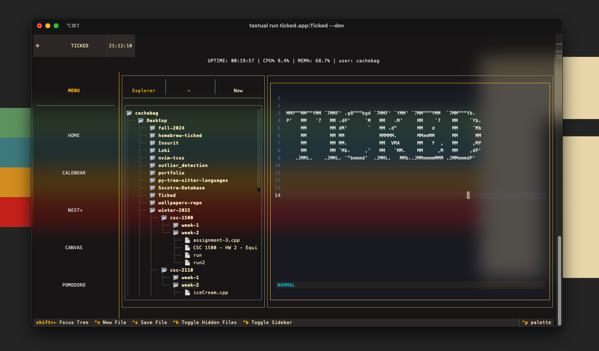

# Ticked 
 

       
## A terminal-based productivity suite built over [Textual](https://textual.textualize.io), designed for STEM students who need a focused work environment.

## Motivation

Most productivity applications offer too few features, leaving critical gaps for what I expect out of a productivity manager. Ticked aims to provide essential tools for students and professionals alike- task management, Spotify integration, Canvas LMS, and note-taking/code-editing capabilities - in a single, distraction-free terminal interface.

I've explored numerous applications offering similar functionality, but they often fall short in two ways: many were created primarily as programming exercises rather than serious tools, and none of them are maintained. Ticked aims to be different - it's built with a clear purpose and a commitment to long-term development and support.

## Core Features

- **Task Management with detailed insights,** fleshed out Todo tracking, and ability to sync calendars over from iCloud, Google, Outlook and more
- **Spotify Integration** with playlist import, search functionality and playback control
- **Note-taking & Code Editing via NEST+** - Syntax highlighting, Vim motions, autopair/indent/complete, and more
- **Canvas LMS System** with course list sync, grade view and metrics, upcoming assignment control and recent announcements via a Markdown viewer
- **Terminal-based Interface** - All ran in your terminal without the need for credentials or a bloated account system. All database data is held locally on your machine, and can easily be sent to other devices to provide a multi-device experience.

## Technical Background

Initially developed in C with ncurses, then migrated to Python with pycurses, Ticked found its final form using [Textual](https://textual.textualize.io) - a modern TUI framework that enables rapid development without sacrificing functionality or aesthetics. It is _insanely_ fun to develop with Textual.

## Development

Please read the <a href="#dev" onclick="event.preventDefault(); loadPage('dev');">Development Guide</a> if you'd like to contribute or work with the code yourself. It is open source under the MIT license.

## Documentation

For detailed information on installation, usage, and contribution guidelines, feel free to start exploring Ticked's features by moving on to the setup page!

<a href="#quick-start" onclick="event.preventDefault(); loadPage('quick-start');">
    <kbd>Next: Setup→</kbd>
</a>

--------
---------
