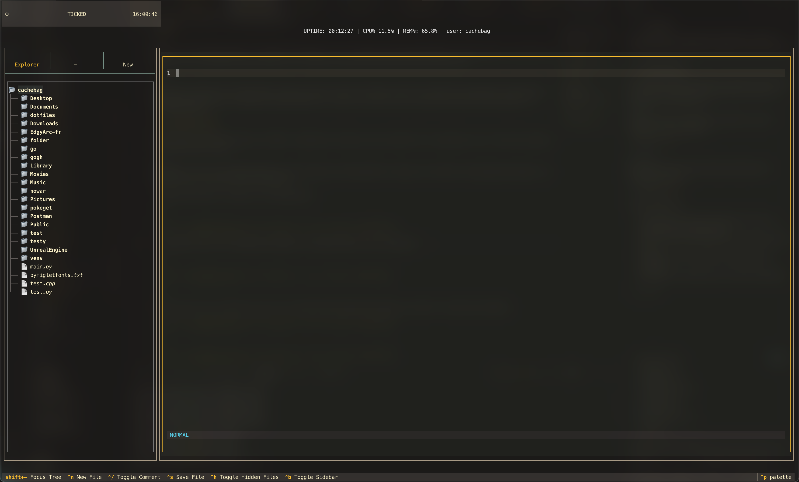
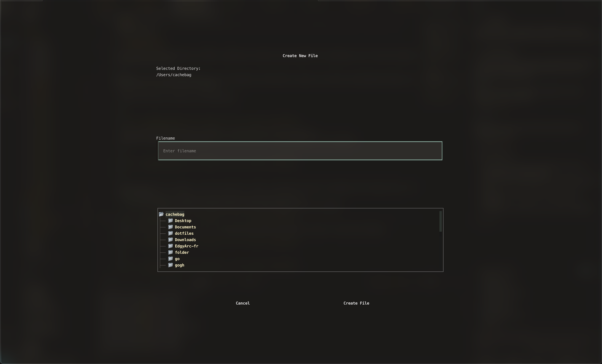
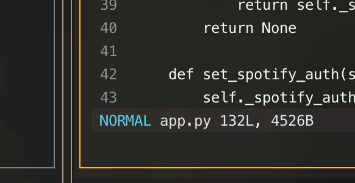

# NEST+ 
 

NEST+ is the bread and butter of Ticked. It's built from the ground up, with many of the features being inspired by Vim. The goal is to implement the most useful plugins and features while still giving a decent amount of control and customization to the user. 

 

Most aren't familiar with code editors like Vim, which is okay. The idea is that for those who are especially interested in communicating with their terminal and learning skills, such as Vim, this will be a place to do that in a bit more of a friendly and straightforward fashion.

##  Navigating NEST+

Since there's a few moving pieces in NEST+, knowing how to make your way around will be a good way to not lose time figuring out how to make it work.

 
In general, you will navigate between your file navigator and code editor using your arrow keys. Upon opening the page, your default focus will be on the file navigator.

- Right arrow key will take you to the Code Editor

 

- The border color of the respective window will indicate what you are "focused" on
- When in the Code Editor, you can press `Shift+left-arrow-key` to focus back on the file navigator.

 

  

- When inside the file navigator, you can use the left, right, up and down arrow keys to navigate your directories and `Enter` to go into them.
- `Ctrl+H` will toggle your hidden files and folder within any given directory
- `Ctrl+N` will create a new file (Currently does not work when focused on the file navigator)

- You can select where to save your newly created file and it will automatically open in a new tab..

 

*There will be future support for deleting files, in addition to creating/deleting folders as well.* 

# Using the code editor

## Code Editor Features

When inside the code editor, the following features are currently supported, though limited in their customization:

- Syntax highlighting for most popular programming languages and markup formats:
    - Python
    - JavaScript
    - HTML
    - CSS
    - YAML
    - JSON
    - SQL
    - XML
- The editor also supports vim motions and commands. Only the following are currently implemented:
    - Motions
        - `dd`: Delete entire line
        - `de`: delete from here, to the end of a line
        - `x`: delete character
        - `w`: go forward to the next word
        - `b`: go back to the previous word
        - `u`: undo
        - `ctrl+r`: redo
    - Commands - To begin using a command, press `Esc` to enter `NORMAL` mode. `:` is the prefix for commands
        - `%d`: Delete everything in current file
        - `w`: Save file | `wq`: Save and quit
        - `q`: Quit current file | `!q`: Force quit without saving
        - `bn` and `n`: Navigate to the next buffer
        - `bp` and `p`: Navigate to the previous buffer
        - `ls`: Show all current buffers
- To use either the commands or the motions, you must be in `NORMAL` mode, triggered by pressing `Esc` when in the code editor. Pressing `i` will take you into `INSERT` mode where you can type like normal. 

- There is a vim-like status bar at the bottom of the editor to indicate file write info, command snippets as well as the current mode you are in and your buffer info.

 

 

- To open multiple files, simply select any from the Navigation tree and they will automatically open up in buffers within the code editor.

- To close buffers, reference the commands above. Typically, it will be just like it is in Vim; `:q`, `q!`, or`:wq`.

 

# Code editing features

There are currently a couple of built in features to enhance the code editing experience in NEST+.

- Autopair

- Auto indent

I plan on implementing Autocomplete in the near future along with some more motions to create a better code editing experience. If anyone has any suggestions, please feel free to propose changes on the codebase. I'm very open to approaching this in another way if it will help the user experience.

Keep an eye on the [GitHub releases](https://github.com/cachebag/Ticked/releases) to find out when NEST+ gets updated.

<a href="#canvas" onclick="event.preventDefault(); loadPage('canvas');">
    <kbd>Next: Canvas LMS →</kbd>
</a>

