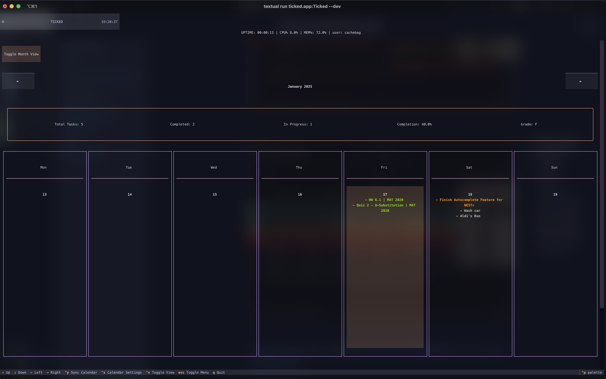
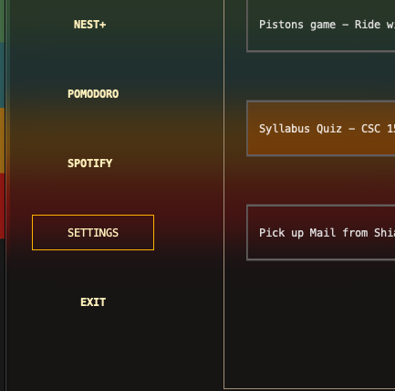
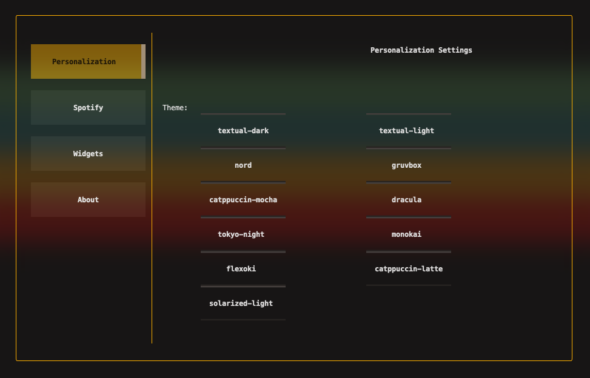

# Setup Guide | Installation
<br>

##  Windows

I've found the best terminals for this are WezTerm and Microsoft's Windows Terminal - `wt`

<br>

Python 3.8+ is required (grab the latest, if you are able to)

Install Tick using pip
   ```powershell
   pip install ticked
   ```

   ```powershell
   ticked
   ```

## macOS/Linux
Users can install Tick through pip or via Homebrew (**Note:** There's a bug where syntax highlighting is not applied in NEST+ if you install through Homebrew)
   ```powershell
   pip install ticked
   ```
   Homebrew
   ```powershell
   brew tap cachebag/ticked

   brew install ticked
   ```
   <br>

   Now, simply run `ticked` in your terminal and you're good to go.

### macOS users can also utilize [iTerm2's](https://iterm2.com/) terminal window customization settings to achieve the look seen in these images where the window is transparent/blurred: 

<br>




#### I'm sure Linux users using environments like Hyprland can achieve a similar look.

# Theme Customization

<br>

### Default Themes
Tick comes with several built-in themes via Textual:
- textual-dark and light
- solarized light
- monokai
- catppuccin-mocha
- catppuccin-latte
- tokyo-night
- gruvbox (Tick's default)
- nord
- dracula
- flexoki
- solarized-light

To change your theme, you can toggle your main menu with `Esc` and head over to settings:






### Creating Custom Themes (COMING SOON)

# Keyboard Navigation

### Good to know Global Shortcuts
- `Ctrl+Q`: Quit application in any view
- `Esc`: Toggle the main menu
- `Tab`: Change focus between elements on any given page

In general, you can navigate the entire app with your arrow, esc and enter keys, except for specific pages where the functionality requires a more graceful approach to navigation, wherein the controls for those pages will show at the footer of the app. Look into the docs of each page for more information.


<div align="right">
<a href="#basics" onclick="event.preventDefault(); loadPage('basics');">
    <kbd>Next: Calendar and Task Management →</kbd>
</a>
</div>