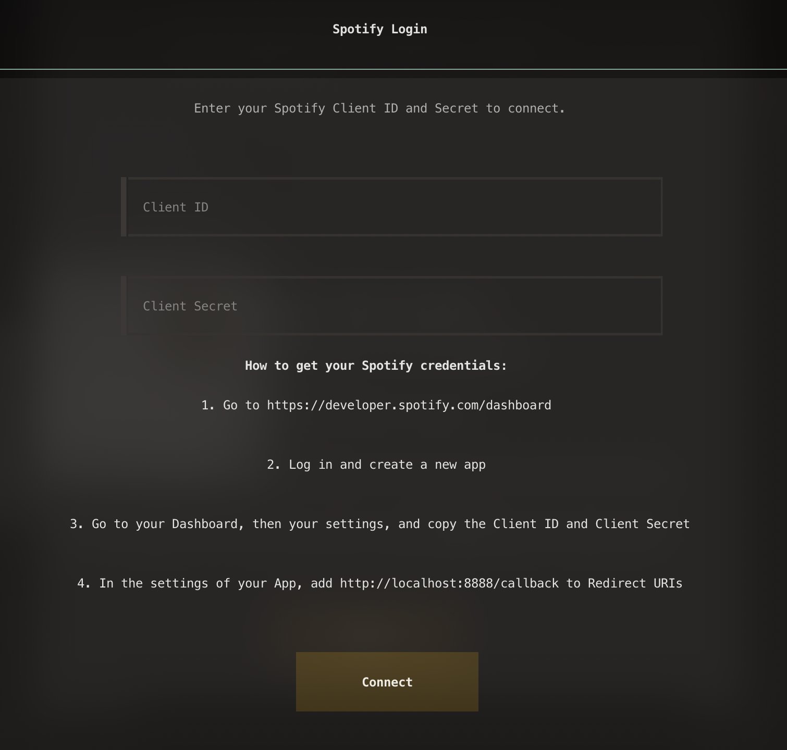
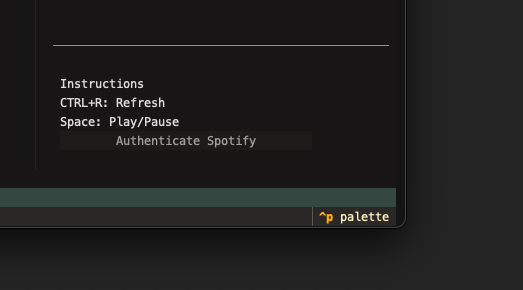
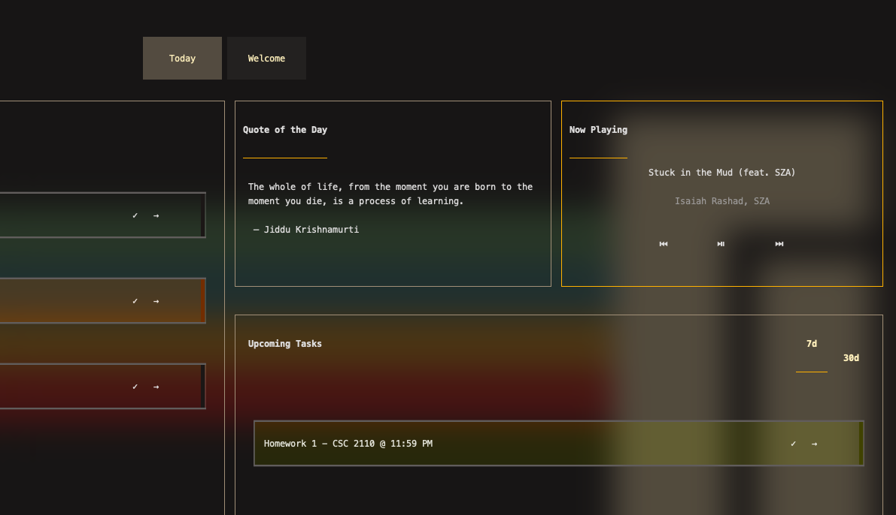

# Spotify Integration (Premium Users Only)
You can access the Spotify interface by doing the following:

1. Log in to your Premium account on the [Spotify Developer Page](https://developer.spotify.com/)
2. Click your account on the top right and select Dashboard
3. Select 'Create App' and fill out the required info.
4. Name it whatever you'd like but ensure that you put "http://localhost:8888/callback" in the 'Redirect URI' section
5. For the section that asks "Which API/SDKs are you planning to use?", select Web API and Web Playback SDK.
6. Go to the settings of your app and copy the Client ID and Client Secret and place them into the input containers on the Spotify page in Ticked
    - 
7. Click connect, and you're set to go! Just note the following:
    - In order to actually use a third-party Spotify API interface like this one, you must have Spotify open on your computer. You can either open it in your web browser, or download and open the [Spotify Desktop app](https://www.spotify.com/us/download/ios/) and return to Ticked to use Spotify playback features.
        - You can also open Spotify on your phone and control playback from Ticked.
    - You cannot use Free accounts with the API. A premium account is required to access the scopes that allow for playlist fetching, search functionality and playback control.

 Control playback from your home view

# Troubleshooting
### Common issues and their solutions:
1. Authentication Failed
    - Please make sure you have a _premium_ account. Spotify API does not give access to free users.
    - Ensure you gave me the right email to ensure access is properly granted.

2. 403 Error - Playback issues
    - The way Spotify's API works, you need to have either Spotify open in a Web Browser, or open on your Desktop app in order to listen to the music. Once you've opened either of those, you can minimize Spotify and return to Tick and continue listening to Spotify.
    - You are also able to simply turn Spotify on from your phone and control it's features from Ticked itself.
    - Please make sure you have a _premium_ account. Spotify API does not give access to free users.

3. Connection Problems
    - You _do_ need an internet connection to access Spotify. There is no offline access. 

For additional support or questions, please don't hesitate to open an issue on the [GitHub](https://github.com/cachebag/Tick) or contact me directly.

<a href="#dev" onclick="event.preventDefault(); loadPage('dev');">
    <kbd>Next: Development →</kbd>
</a>

 